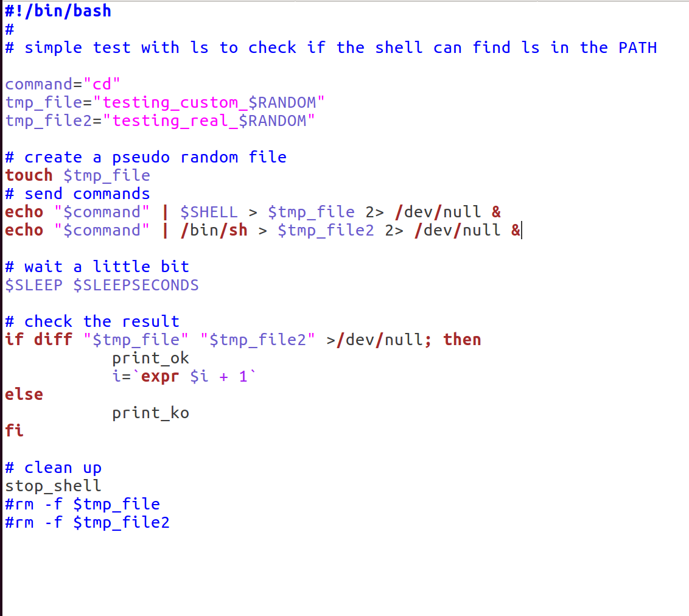
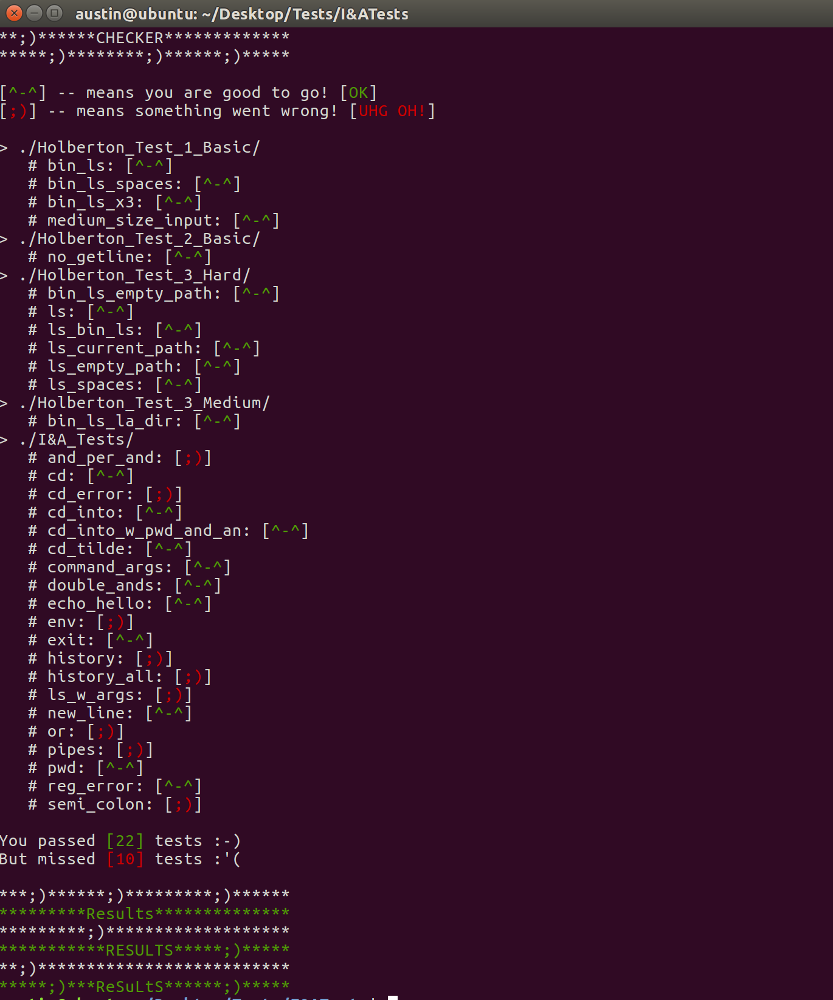

# Welcome to the I&A Checker ;)
## It works very similar Holberton's shell checker found [here](https://github.com/holbertonschool/0x15.c/).

### First thing first, you need to change the config file where it says `SHELL`, to reflect the directory of your shell like so: 
`SHELL="../../HolbertonRepos/bash_stuff/simple_shell/V3/h"`

### Lastly, just run the script by typing 
`./check_simple_shell.bash`

### You can debug your code by commenting out the `rm -f` lines at the bottom of a given script like so:

## Final result should look something like:

